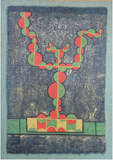
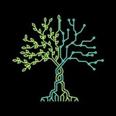
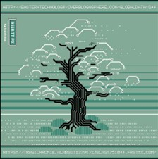
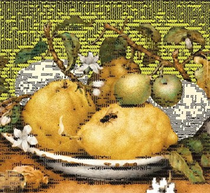
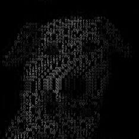
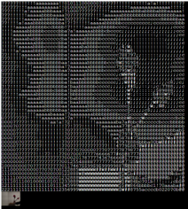

# QUIZ 8
Work：: Anwar Jalal Shemza 'Apple Tree'

**Inspiration**: The everyday ‘apple tree’ is transformed into a geometrically arranged visual structure. The coexistence of nature and order in the original work symbolises the connection between individual and system, life and language.

In the context of contemporary technology, algorithms, genes and reality are gradually intertwined, and people are travelling between perception and generation. This work tries to explore: when natural images are highly programmed, can we still clearly distinguish between reality and the digital world? Perhaps the logic and will of ‘life’ have long been hidden behind the geometry.

# PART 1
This project fuses a real tree with a geometric, abstracted image of an ‘apple tree’ to construct a life form that seems to be generated by code (Figure 2). Through the anthropomorphic representation of the image, we explore the perceptual boundaries between the digital and the real, the algorithmic and the genetic, which are constantly intertwined (Figure 3). In the process, the cold image system is infused with emotions and a sense of life. The work attempts to ask: **will digital life one day also evolve into real life forms (Fig. 1)?**

 figure 1
 figure 2
 figure 3

# PART 2

**-Particle abstraction:**

Using the particle system effect in Figure 4 [coding language](https://editor.p5js.org/codingtrain/sketches/DhdqcoWn4), the original ‘Apple Tree’ is transformed into a geometrical form composed of points, so that it ‘floats’ and ‘grows’ in the virtual world.

 figure 4

**-Real-life image fusion:**

In  figure 5, use the camera to capture real-life tree images and use them as input image data for real-time visual fusion with the virtual particle tree [coding language](https://editor.p5js.org/codingtrain/sketches/KTVfEcpWx).

 figure 5

**-Virtual-Real Dialogue Construction:**

Through the superposition and transformation of abstract generative maps and real images, we construct a digital life scene in which virtual and real coexist, and explore the possibility of re-generation and emotional expression of natural images in a digital context.

